# 自助台球厅管理系统

自助台球厅管理系统是一个完整的台球厅智能化管理解决方案，旨在实现台球厅的无人化或少人化运营。系统包含后台管理系统、用户端微信小程序和管理端前端界面。用户可通过小程序完成查找门店、扫码开台、自助计时计费等操作，商家则通过后台系统进行门店管理、桌台管理、会员管理、订单处理和数据统计等核心业务操作。

# 多租户系统设计
   ## 系统定位
        - 多租户SaaS：租户(tenant) → 商户(merchant) 1:N → 门店(store) N。
        - 小程序“聚合形态”：一个小程序服务多个租户/商户/门店。
   ## 数据与隔离
        - 业务表统一含 tenant_id；桌台/会员/积分/订单/资金等再含 merchant_id（按商户隔离）。
        - 用户表 bls_user 为平台级账户（不绑定商户；聚合小程序登录不强绑定租户）。
        - 订单链路冗余 merchant_id，便于统计与对账。
   ## 更新设计可查看doc目录下的文档
# 线上后台管理地址
https://www.banyue.xin/billiards/
 - 账号：admin
 - 密码：123456
 - 多租户模式，需要先选择租户，在租户输入框至少输入三个相关连续字符，系统自动检索相关租户，选择对应租户之后再输入相应的用户名密码进行登录
 - 如果是新申请的租户，登录账号为申请时的手机号码，初始密码是：123456

## 项目结构

```
├── backend/                       # 后端源码
│   └── billiards-admin/           # 基于RuoYi框架的后台管理系统
│       ├── billiards-service/     # 台球厅业务逻辑服务
│       ├── ruoyi-admin/           # 后台管理入口模块
│       ├── ruoyi-common/          # 通用工具模块
│       ├── ruoyi-modules/         # 功能模块
│       ├── ruoyi-extend/          # 扩展功能
│       └── script/                # 脚本文件
│
├── frontend/                      # 前端源码
│   ├── admin-ui/                  # 管理端前端界面 (Vue3+Element Plus)
│   ├── mini/                      # 微信小程序源码
│   └── app/                       # 移动应用源码
│
├── docs/                          # 项目文档
│   └── sql/                       # 数据库脚本
```

## 技术栈

### 后端技术栈

- **基础框架**：Spring Boot 3.x
- **安全认证**：Sa-Token 1.42.0
- **数据库操作**：MyBatis Plus 3.5.x
- **数据库**：MySQL 8.0
- **缓存**：Redis
- **多租户**：MyBatis-Plus TenantLineInnerInterceptor + 会话级租户/商户上下文
- **API文档**：SpringDoc OpenAPI
- **工具库**：Hutool、EasyExcel、Lombok

### 前端技术栈

- **管理端**：Vue 3 + TypeScript + Vite + Element Plus
- **小程序**：微信小程序原生开发
- **构建工具**：Vite

## 主要功能

### 1. 门店管理（已完成）
- ✅ 门店信息维护
- ✅ 营业时间设置
- ✅ 地理位置管理
- ✅ 门店照片管理
- ✅ 门店状态监控

### 2. 桌台管理（已完成）
- ✅ 桌台维护与类型管理
- ✅ 桌台二维码生成
- ✅ 桌台状态实时监控
- ✅ 桌台预约与锁定

### 3. 计费系统（已完成）
- ✅ 标准计费规则
- ✅ 阶梯计费规则
- ✅ 会员价格配置

### 4. 订单管理（已完成）
- ✅ 用户自助开台
- ✅ 实时计费展示
- ✅ 订单状态管理
- ✅ 在线支付结算
- ✅ 订单查询与统计

### 5. 营收统计（已完成）
- ✅ 实时营收监控
- ✅ 营收报表统计
- ✅ 桌台使用率分析
- ✅ 数据可视化展示

### 6. 系统管理（已完成）
- ✅ 商家账户管理
- ✅ 角色权限控制
- ✅ 操作日志记录
- ✅ 系统配置管理
- ✅ 数据字典管理

## 快速开始

### 后端服务启动

1. 准备环境：JDK 17+、Maven 3.6+、MySQL 8.0+、Redis 7.0+
2. 创建数据库并导入SQL脚本：
   ```sql
   CREATE DATABASE billiards DEFAULT CHARACTER SET utf8mb4 COLLATE utf8mb4_general_ci;
   ```
3. 导入数据库脚本（根据模式选择）：
   - 多租户（SaaS）：`docs/sql/billiards-saas.sql`
   - 单体（无租户）：`docs/sql/billiards.sql`
4. 配置数据库连接信息（application-dev.yml）
5. 构建与运行：
   ```bash
   cd backend/billiards-admin
   mvn clean package -DskipTests
   java -jar ruoyi-admin/target/billiards-admin.jar --spring.profiles.active=dev
   ```

### 前端启动

1. 准备环境：Node.js 18+
2. 启动管理端：
   ```bash
   cd frontend/admin-ui
   npm install
   npm run dev
   ```
3. 访问管理系统：http://localhost:8081

## 多租户与小程序调用约定

- **架构模型**：SaaS，多租户（tenant）→ 多商户（merchant）1:N。业务表统一含 `tenant_id`，资金/会员/积分/订单等再含 `merchant_id`；平台级账户表不绑定商户，聚合小程序登录不强绑定租户，落业务前需选择门店。
- **数据隔离与写入**：MyBatis-Plus `TenantLineInnerInterceptor` 全局生效；通过 MetaObjectHandler 自动填充 `tenant_id`（取自 `TenantHelper`）与 `merchant_id`（取自 `MerchantHolder`）。
- **小程序请求上下文**：
  - 所有资金/订单相关请求必须携带请求头 `X-Store-Id`。
  - 前端流程：扫码/选台 → 解析 `storeId` → 设置全局与本地缓存 → HTTP 拦截器自动添加 `X-Store-Id` → 余额校验/充值 → 创建订单。
- **后端解析与路由**：
  - `MiniAppTenantInterceptor` 基于 `X-Store-Id` 解析 `{tenantId, merchantId}`，并分别通过 `TenantHelper.setDynamic(...)` 与 `MerchantHolder.set(...)` 进行会话级持久化。
  - 小程序接口统一挂载在前缀 `/api/miniapp/**`。
- **后台端登录**：登录成功后 `TenantHelper.setDynamic(tenantId, true)`；`currentMerchantId` 存入会话；写入自动填充，查询可按商户范围过滤。
- **数据权限**：支持在查询侧使用 `@DataPermission` 按 `merchant_id` 进行过滤（可用于除租户隔离之外的商户级隔离）。
- **支付路由**：服务商模式；支付配置按「门店 > 商户 > 租户」三层覆盖。发起支付使用 `(tenantId, merchantId, storeId, appId)` 选择通道，`appId` 仅用于通道选择，不用于推断租户。
- **前端注意**：管理端 admin-ui 无需 `X-Store-Id`；小程序端由拦截器自动添加该请求头。

## 微信小程序

1. 安装微信开发者工具
2. 导入 `frontend/mini` 目录
3. 配置小程序AppID
4. 编译运行小程序

## 开发与部署

### 开发环境
- 后端：使用 `dev` 配置
- 前端：使用 `.env.development` 环境变量

### 生产环境
- 后端：使用 `prod` 配置
- 前端：使用 `.env.production` 环境变量

### Docker 部署
项目提供了 Dockerfile，支持容器化部署：
```bash
# 构建后端镜像
cd backend/billiards-admin
docker build -t billiards-admin:latest .

# 构建前端镜像
cd frontend/admin-ui
docker build -t billiards-admin-ui:latest .

# 使用docker-compose部署
cd backend/billiards-admin/script/docker
docker-compose up -d
```

## 系统截图


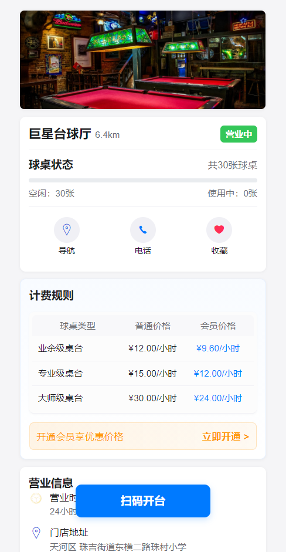
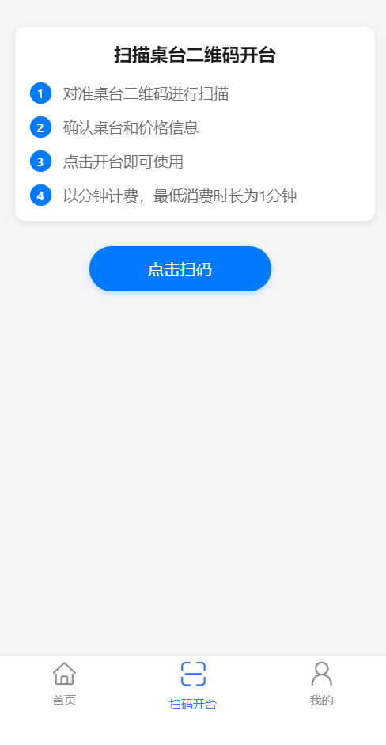
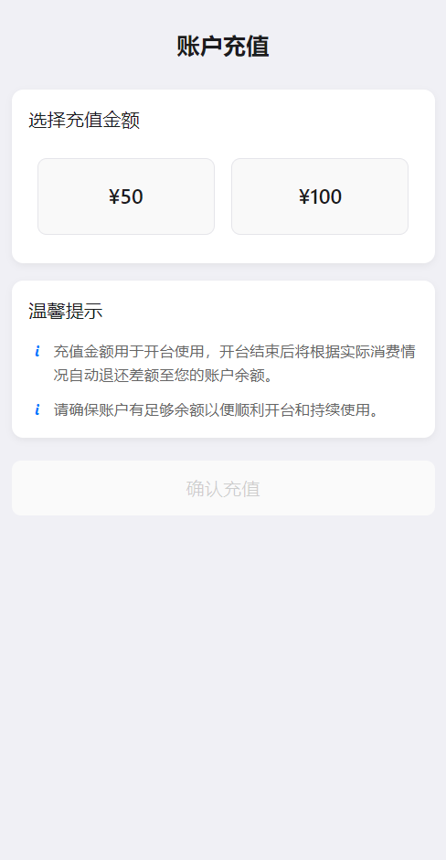
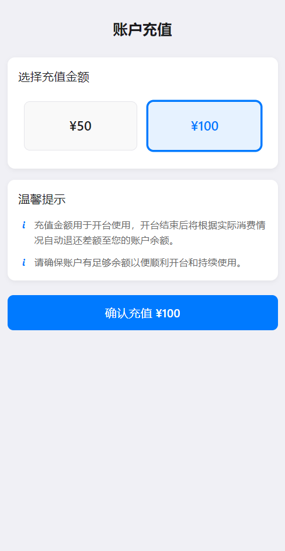
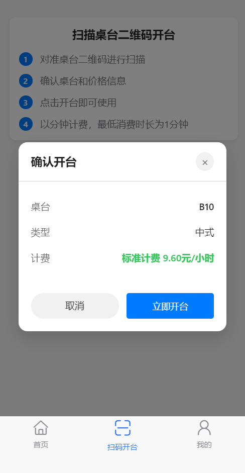
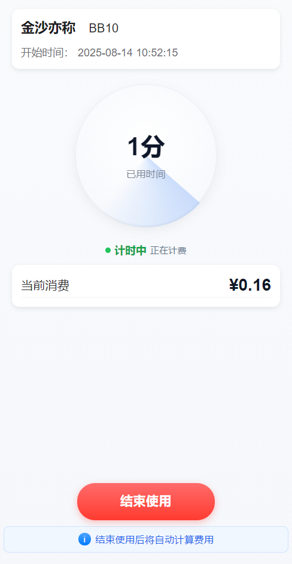
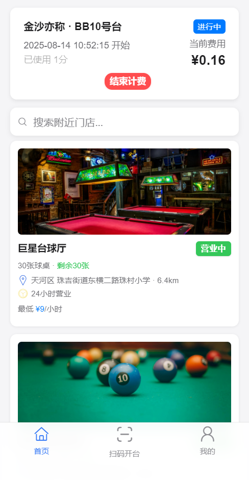
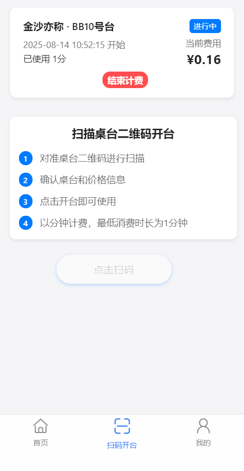
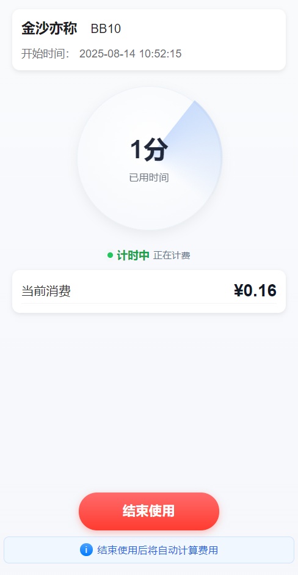
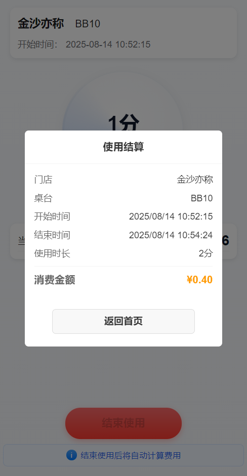
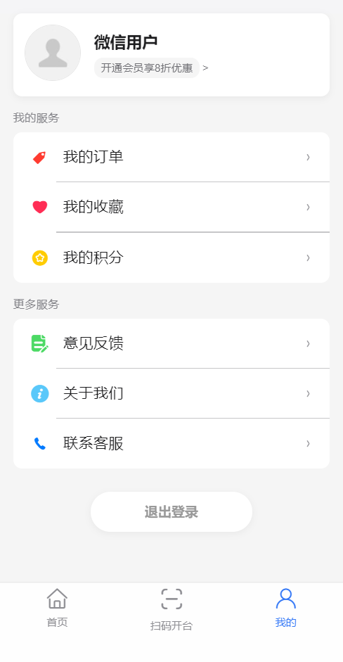
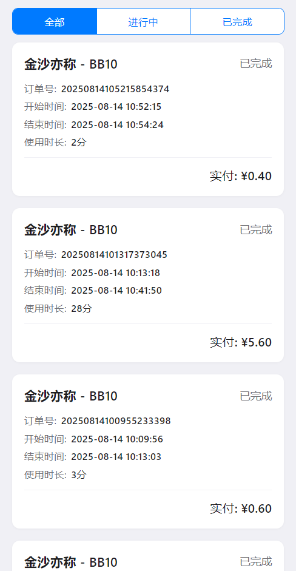
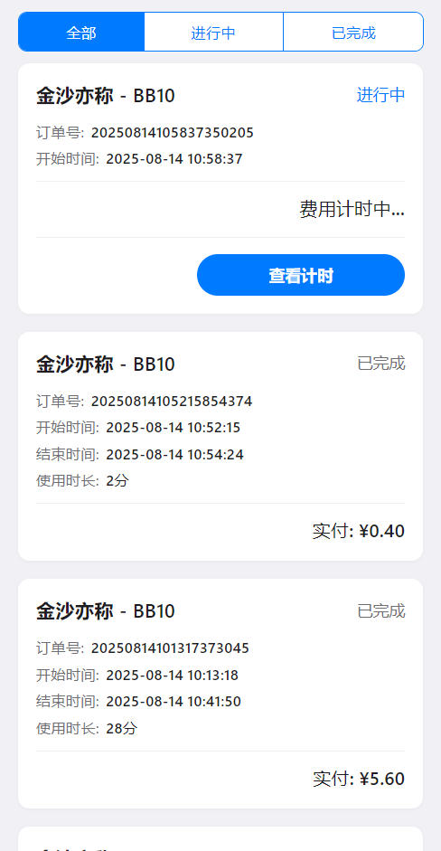

## 管理页面截图

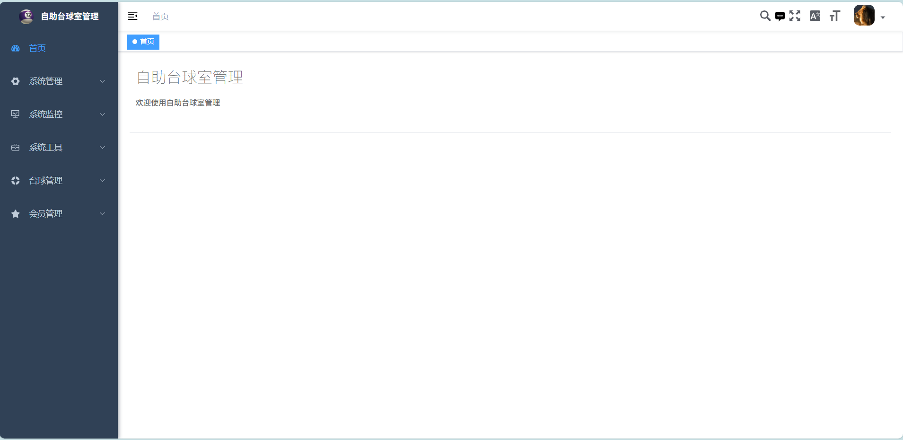
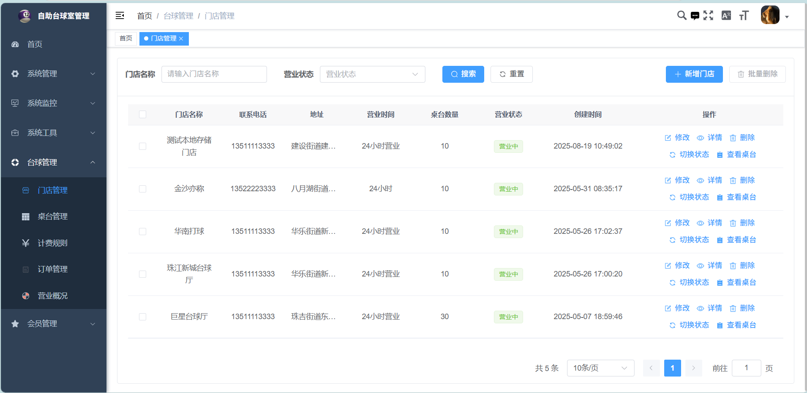
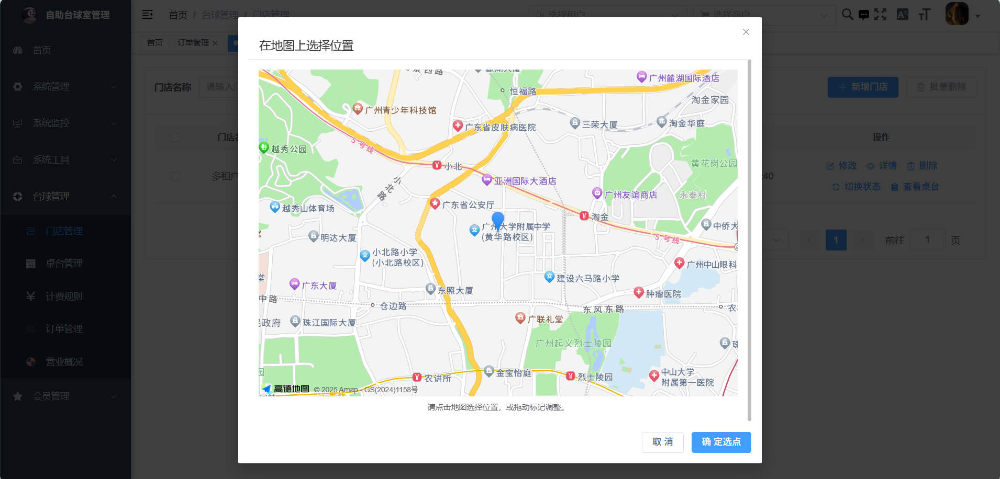
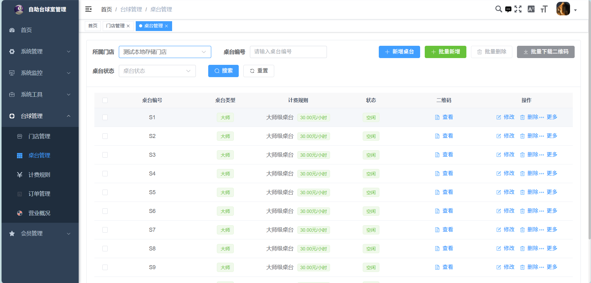
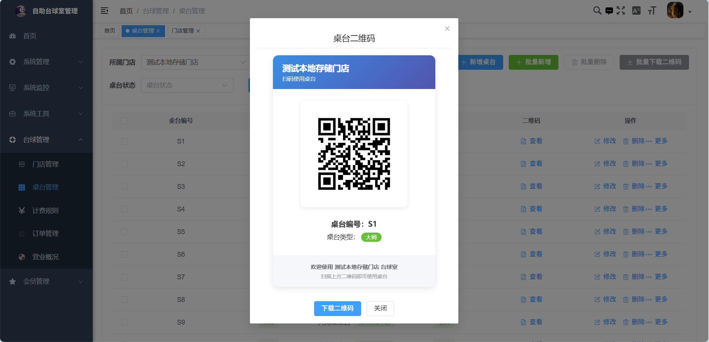
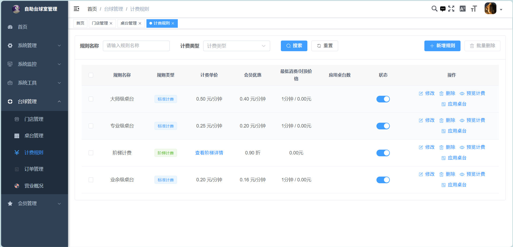
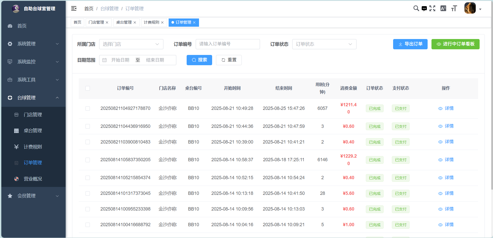
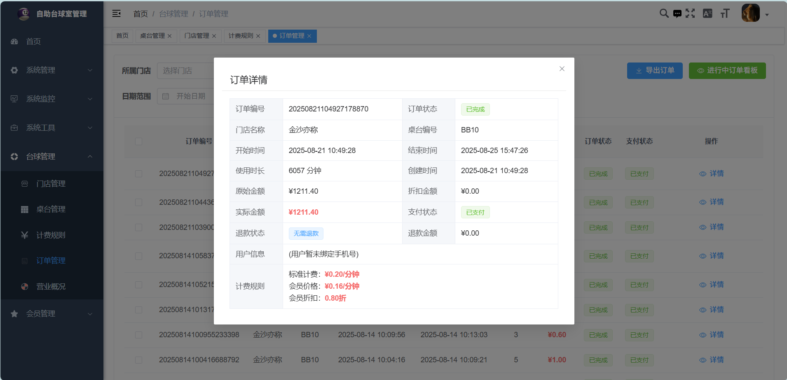


## 下阶段目标
- [ ] 增加会员管理功能
- [ ] 增加营销活动功能


## 贡献指南
1. Fork 本仓库
2. 创建特性分支 (`git checkout -b feature/amazing-feature`)
3. 提交更改 (`git commit -m 'Add some amazing feature'`)
4. 推送到分支 (`git push origin feature/amazing-feature`)
5. 开启 Pull Request

## 补充说明

1. 本系统允许用于商业用途，且不收费，**但切记不要用于任何非法用途** ，作者不会为此承担任何责任
2. 基于本系统二次开发后再次开源的项目，请注明引用出处，以避免引发不必要的误会

## 许可证
本项目使用 [MIT](LICENSE) 许可证 