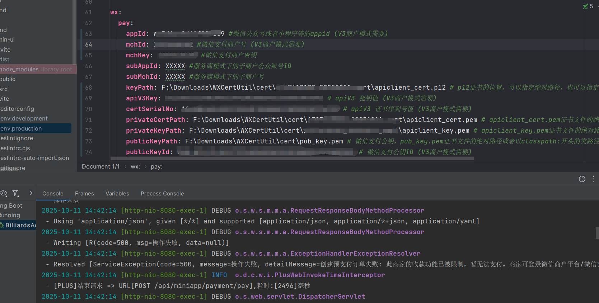
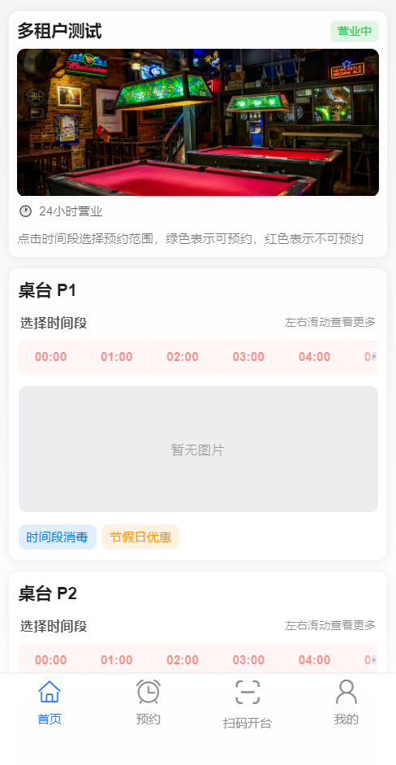
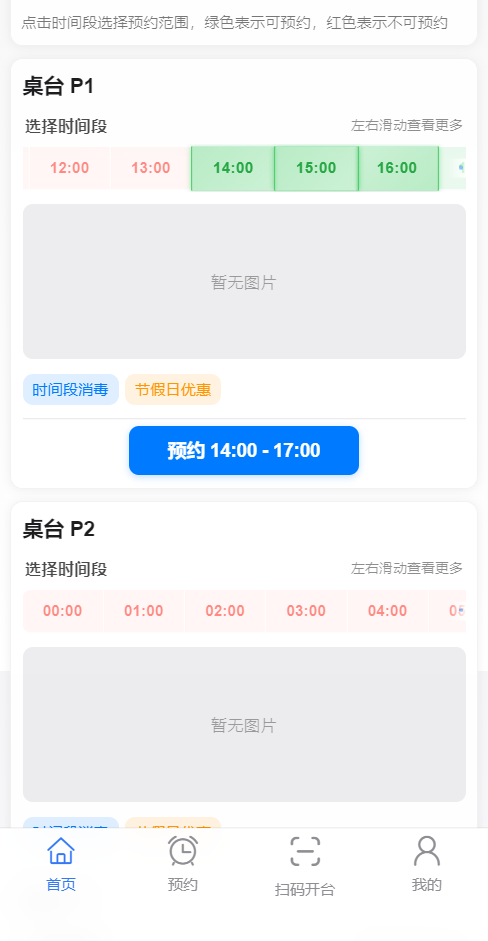
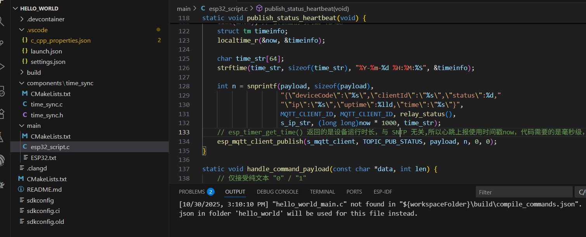
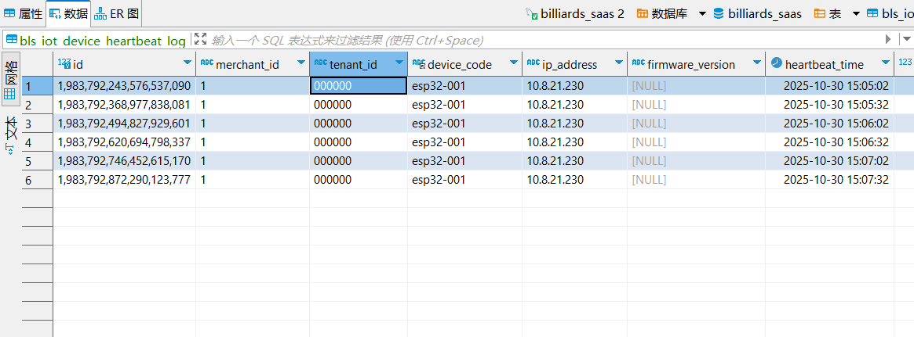
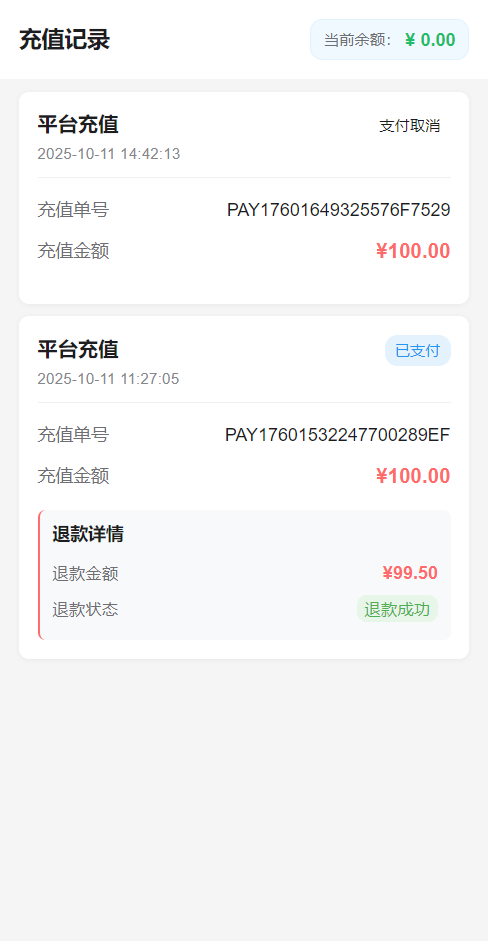
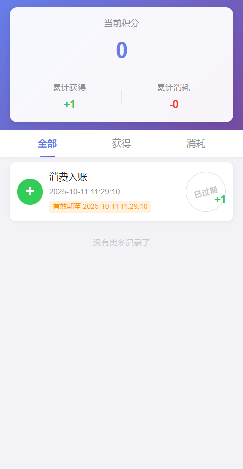
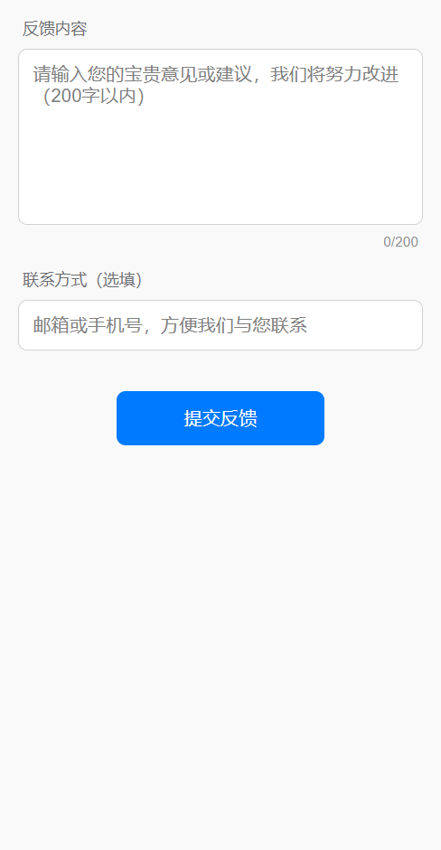
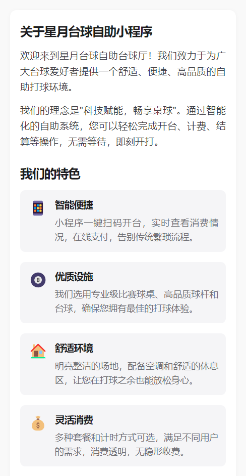
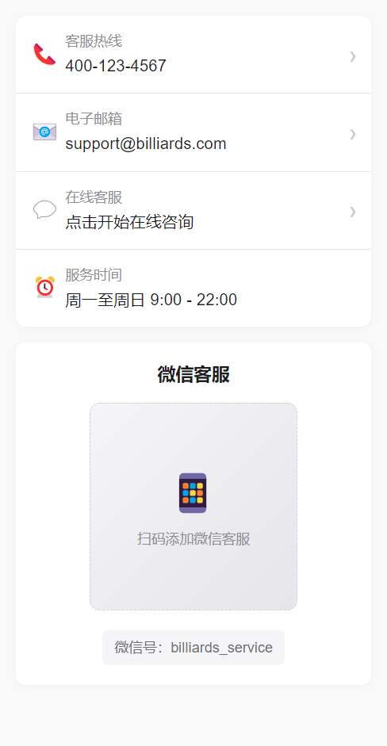

# 自助台球厅管理系统

自助台球厅管理系统是一个完整的台球厅智能化管理解决方案，旨在实现台球厅的无人化或少人化运营。系统采用SaaS多租户架构，支持多租户、多商户、多门店的统一管理。

## 系统概述

系统包含三个核心部分：
- **后台管理系统**：商家通过Web端管理门店、桌台、订单、会员等业务数据
- **用户端微信小程序**：用户通过小程序查找门店、扫码开台、自助计时计费、预约桌台等
- **IoT物联网控制**：系统自动控制硬件设备（灯光、锁具、音响等），实现智能化运营

## 核心价值

- **提升运营效率**：无人化或少人化运营，降低人力成本，提升运营效率
- **优化用户体验**：用户自助操作，扫码即用，支付便捷，体验流畅
- **智能化管理**：IoT设备自动控制，预约功能优化资源配置，数据统计辅助决策
- **多租户SaaS架构**：一套系统服务多个租户/商户，降低部署成本，易于扩展

## 多租户系统设计

### 系统定位

- **多租户SaaS架构**：租户(tenant) → 商户(merchant) 1:N → 门店(store) N
- **小程序聚合形态**：一个小程序服务多个租户/商户/门店，用户无需切换小程序即可访问不同门店

### 数据隔离机制

- **租户级隔离**：业务表统一含 `tenant_id`，通过 MyBatis-Plus 租户拦截器自动过滤
- **商户级隔离**：桌台/会员/积分/订单/资金等业务表再含 `merchant_id`，实现商户间数据隔离
- **平台级账户**：用户表 `bls_user` 为平台级账户，不绑定商户；聚合小程序登录不强绑定租户
- **订单链路冗余**：订单链路冗余 `merchant_id`，便于统计与对账

**详细设计文档：** 可查看 `docs` 目录下的相关文档

---

## 线上演示地址

**后台管理系统：** https://www.banyue.xin/billiards/

**测试账号信息：**
- **租户**：有限公司
- **账号**：admin
- **密码**：123456

**登录说明：**
- 多租户模式，需要先选择租户
- 在租户输入框至少输入三个相关连续字符，系统自动检索相关租户
- 选择对应租户之后再输入相应的用户名密码进行登录
- 如果是新申请的租户，登录账号为申请时的手机号码，初始密码是：123456

## 项目结构

```
├── backend/                       # 后端源码
│   └── billiards-admin/           # 基于RuoYi框架的后台管理系统
│       ├── billiards-service/     # 台球厅业务逻辑服务
│       ├── ruoyi-admin/           # 后台管理入口模块
│       ├── ruoyi-common/          # 通用工具模块
│       ├── ruoyi-modules/         # 功能模块
│       ├── ruoyi-extend/          # 扩展功能
│       └── script/                # 脚本文件
│
├── frontend/                      # 前端源码
│   ├── admin-ui/                  # 管理端前端界面 (Vue3+Element Plus)
│   ├── mini/                      # 微信小程序源码
│   └── app/                       # 移动应用源码
│
├── docs/                          # 项目文档
│   └── sql/                       # 数据库脚本
```

## 技术栈

### 后端技术栈

- **基础框架**：Spring Boot 3.x
- **安全认证**：Sa-Token 1.42.0（支持多租户、多商户会话管理）
- **数据库操作**：MyBatis Plus 3.5.x（支持多租户自动过滤、代码生成）
- **数据库**：MySQL 8.0
- **缓存**：Redis（用于会话管理、分布式锁、缓存等）
- **多租户**：MyBatis-Plus TenantLineInnerInterceptor + 会话级租户/商户上下文
- **对象转换**：MapStruct（Entity/DTO/VO转换）
- **API文档**：SpringDoc OpenAPI（Swagger 3）
- **工具库**：Hutool（工具类）、EasyExcel（Excel导入导出）、Lombok（代码简化）
- **支付集成**：微信支付（服务商模式）
- **消息队列**：MQTT（IoT设备通信，基于EMQX）

### 前端技术栈

- **管理端**：Vue 3 + TypeScript + Vite + Element Plus
- **小程序**：微信小程序原生开发（TypeScript）
- **构建工具**：Vite
- **UI风格**：小程序采用Apple风格设计规范，界面简洁美观

## 主要功能

### 1. 门店管理（已完成）

门店管理是系统的核心基础模块，支持多门店、多商户的统一管理。

**核心功能：**
- ✅ **门店信息维护**：支持门店基本信息录入，包括门店名称、联系方式、详细地址等
- ✅ **营业时间设置**：灵活配置门店营业时间段，支持工作日与节假日差异化设置
- ✅ **地理位置管理**：基于地理位置的门店检索与导航，支持地图选点与坐标定位
- ✅ **门店照片管理**：支持多张门店照片上传，展示门店环境与设施
- ✅ **门店状态监控**：实时监控门店营业状态（营业中/已打烊/维护中），支持远程控制门店状态
- ✅ **门店收藏功能**：用户可收藏常用门店，快速访问

**应用场景：**
- 商家通过后台管理系统维护门店信息，设置营业时间
- 用户通过小程序查找附近门店，查看门店详情与营业状态
- 系统根据门店位置为用户推荐最近门店

---

### 2. 桌台管理（已完成）

桌台管理模块提供完整的台球桌生命周期管理，支持桌台状态实时监控与智能调度。

**核心功能：**
- ✅ **桌台维护与类型管理**：支持桌台基本信息维护，包括桌台编号、类型、规格等，支持多种桌台类型配置
- ✅ **桌台二维码生成**：自动生成唯一二维码，用户扫码即可快速开台，支持二维码批量生成与打印
- ✅ **桌台状态实时监控**：实时显示桌台状态（空闲/使用中/预约中/维护中），支持状态变更历史查询
- ✅ **桌台预约与锁定**：支持桌台预约功能，预约期间自动锁定桌台，防止冲突
- ✅ **桌台设备绑定**：支持将IoT设备（灯光、锁具、音响等）绑定到指定桌台，实现智能控制

**应用场景：**
- 商家在后台配置桌台信息，生成二维码并打印张贴
- 用户扫码开台，系统自动识别桌台并创建订单
- 管理员实时监控所有桌台使用状态，优化资源配置

---

### 3. 计费管理（已完成）

计费管理模块提供灵活的计费规则配置，支持多种计费模式，满足不同业务场景需求。

**核心功能：**
- ✅ **标准计费规则**：支持按时长计费，可配置不同时段（如工作日/节假日、白天/夜晚）的差异化价格
- ✅ **阶梯计费规则**：支持阶梯式计费，使用时长越长单价越低，鼓励用户长时间使用
- ✅ **会员价格配置**：支持为不同会员等级配置专属价格，会员享受折扣优惠
- ✅ **计费规则优先级**：支持多层级计费规则配置（门店级/商户级/租户级），按优先级自动匹配
- ✅ **计费规则预览**：提供计费规则预览功能，可模拟计算不同时长的费用

**应用场景：**
- 商家根据经营策略配置计费规则，如工作日优惠、会员折扣等
- 系统根据用户会员等级与使用时长自动计算费用
- 支持灵活的营销活动，如限时优惠、新用户折扣等

---

### 4. 订单管理（已完成）

订单管理模块是用户与商家交互的核心，提供完整的订单生命周期管理。

**核心功能：**
- ✅ **用户自助开台**：用户扫码后自动创建订单，支持余额校验与充值引导
- ✅ **实时计费展示**：订单进行中实时显示已使用时长与当前费用，支持费用预估
- ✅ **订单状态管理**：完整的订单状态流转（使用中/已结算/已取消/异常），支持状态变更记录
- ✅ **在线支付结算**：支持微信支付、余额支付、积分抵扣等多种支付方式，支付流程安全可靠
- ✅ **订单查询与统计**：用户可查询历史订单，商家可统计订单数据，支持多维度筛选与导出
- ✅ **订单退款功能**：支持主动退款操作，退款流程规范，记录完整退款日志

**应用场景：**
- 用户扫码开台，系统自动创建订单并开始计时
- 用户使用过程中实时查看费用，使用结束后一键结算
- 商家通过订单统计了解经营状况，优化经营策略

---

### 5. 会员与积分系统（已完成）

会员系统提供完整的会员等级体系与积分管理，增强用户粘性与复购率。

**核心功能：**
- ✅ **会员等级体系**：支持多级会员体系（普通/银牌/金牌/钻石），根据累计消费自动升级
- ✅ **会员权益管理**：不同等级享受不同折扣优惠，支持生日特权、专属服务等权益配置
- ✅ **积分获取**：消费自动获得积分，支持会员等级积分倍率加成，积分规则灵活可配
- ✅ **积分使用**：支持积分抵扣订单费用，默认100积分抵扣1元，抵扣比例可配置
- ✅ **积分记录查询**：用户可查询积分获取与使用记录，支持积分有效期管理
- ✅ **会员信息管理**：用户可查看会员等级、累计消费、当前积分等信息

**应用场景：**
- 用户消费后自动累计消费金额，达到条件自动升级会员等级
- 会员享受专属折扣，使用积分抵扣费用，提升消费体验
- 商家通过会员数据分析了解用户消费习惯，制定精准营销策略

---

### 6. 钱包与充值系统（已完成）

钱包系统提供安全的资金管理，支持充值、消费、退款等完整资金流转。

**核心功能：**
- ✅ **钱包账户管理**：用户自动创建钱包账户，支持余额查询与资金明细
- ✅ **在线充值**：支持微信支付充值，充值金额灵活选择，充值记录完整保存
- ✅ **余额支付**：订单结算支持余额支付，支付流程便捷安全
- ✅ **充值记录查询**：用户可查询所有充值记录，包括充值时间、金额、支付方式等
- ✅ **主动退款功能**：用户可申请退款，系统自动处理退款流程，退款记录可追溯
- ✅ **资金安全**：支持资金冻结机制，异常订单自动冻结资金，保障资金安全

**应用场景：**
- 用户充值到钱包，后续消费直接使用余额支付，无需重复支付
- 用户可随时查询充值记录与余额变动，资金流向透明
- 支持退款功能，提升用户信任度与满意度

---

### 7. 预约功能（已完成）

预约功能支持用户提前预约桌台，提升用户体验与门店资源利用率。

**核心功能：**
- ✅ **在线预约**：用户可选择门店、桌台与时间段进行预约，支持跨时间段预约
- ✅ **预约时间段展示**：可视化展示可预约时间段，绿色表示可预约，红色表示已占用
- ✅ **预约冲突检测**：系统自动检测时间段冲突，防止重复预约，使用分布式锁保证并发安全
- ✅ **预约到店确认**：用户到店后扫码开台，系统自动将预约状态更新为已到店
- ✅ **预约取消功能**：用户可取消未开始的预约，支持预约取消规则配置
- ✅ **预约超时处理**：预约开始后未到店自动过期，释放桌台资源
- ✅ **预约记录查询**：用户可查询预约记录，包括预约状态、时间、桌台等信息
- ✅ **预约配置管理**：支持配置预约最短时长、最长时长、提前预约天数等参数

**应用场景：**
- 用户提前预约心仪桌台，避免到店无台可用
- 商家通过预约功能合理安排资源，提升桌台利用率
- 系统自动处理预约冲突与超时，减少人工干预

**预约配置说明：**
- 最短预约时长：默认30分钟，可配置
- 最长预约时长：默认120分钟，可配置
- 提前预约天数：默认可提前3天预约
- 预约超时时间：预约开始后5分钟未到店自动过期
- 用户限制：每日最多预约次数、同时进行中预约上限等

---

### 8. IoT物联网设备控制（已完成）

IoT模块实现业务系统与硬件设备的无缝集成，支持开台自动控制设备，提升智能化水平。

**核心功能：**
- ✅ **设备管理**：支持设备注册、配置与管理，支持多种设备类型（灯光、锁具、音响等）
- ✅ **协议支持**：支持MQTT、HTTP等多种通信协议，通过执行器模式灵活扩展
- ✅ **场景绑定**：支持将设备绑定到业务场景（开台/关台/超时提醒等），配置化控制流程
- ✅ **自动控制**：用户开台后自动触发设备控制，如开灯、解锁、播放语音等
- ✅ **设备状态监控**：实时监控设备在线状态，支持设备心跳检测，离线自动告警
- ✅ **控制日志记录**：所有设备控制操作记录日志，支持控制历史查询与故障排查
- ✅ **异常处理**：设备控制失败不影响业务主流程，支持重试机制与告警通知
- ✅ **设备告警**：设备离线、控制失败等异常自动产生告警，支持多级告警通知

**应用场景：**
- 用户扫码开台后，系统自动开启台灯、解锁球杆锁、播放欢迎语音
- 订单结算后，系统自动关闭台灯、锁定设备
- 管理员通过后台监控设备状态，及时发现并处理设备故障

**技术特点：**
- **业务无感知**：设备控制完全由后端自动化处理，前端无需关心设备细节
- **通用可扩展**：支持任意类型设备，通过配置即可接入新设备
- **协议兼容**：通过执行器模式支持多种通信协议，易于扩展
- **容错可靠**：设备异常不影响核心业务，保障系统稳定性

**设备控制流程：**
1. 用户扫码开台 → 创建订单
2. 系统查询设备绑定配置 → 获取需要控制的设备列表
3. 按顺序执行设备控制 → 开灯 → 解锁 → 播放语音
4. 记录控制日志 → 失败时产生告警

**ESP32设备支持：**
- 提供ESP32烧录脚本，支持MQTT协议通信
- 设备自动上报心跳，系统监控设备在线状态
- 支持继电器控制，可控制灯光、锁具等设备

---

### 9. 营收统计（已完成）

营收统计模块提供全面的数据分析，帮助商家了解经营状况，优化经营策略。

**核心功能：**
- ✅ **实时营收监控**：实时显示当前营收数据，包括今日营收、订单数、桌台使用率等
- ✅ **营收报表统计**：支持按日/周/月/年统计营收数据，支持多维度数据分析
- ✅ **桌台使用率分析**：统计各桌台使用时长与使用率，识别热门桌台与闲置资源
- ✅ **数据可视化展示**：通过图表直观展示营收趋势、订单分布、会员消费等数据
- ✅ **多维度筛选**：支持按门店、时间、订单状态等多维度筛选统计
- ✅ **数据导出功能**：支持将统计数据导出为Excel，便于进一步分析

**应用场景：**
- 商家通过营收统计了解经营状况，识别经营问题
- 通过桌台使用率分析优化资源配置，提升盈利能力
- 通过会员消费分析制定精准营销策略，提升用户复购率

---

### 10. 系统管理（已完成）

系统管理模块提供完整的后台管理功能，保障系统安全稳定运行。

**核心功能：**
- ✅ **商家账户管理**：支持多租户、多商户账户管理，账户权限隔离
- ✅ **角色权限控制**：基于RBAC的权限控制，支持角色自定义与权限分配
- ✅ **操作日志记录**：记录所有关键操作日志，支持日志查询与审计
- ✅ **系统配置管理**：支持系统参数配置，如预约规则、计费规则、会员规则等
- ✅ **数据字典管理**：统一管理数据字典，支持字典项维护与查询
- ✅ **多租户管理**：支持多租户数据隔离，租户间数据完全隔离
- ✅ **商户管理**：支持多商户管理，商户数据按商户ID隔离

**应用场景：**
- 管理员通过系统管理配置系统参数，维护数据字典
- 通过操作日志追踪系统操作，保障系统安全
- 通过权限控制保障数据安全，防止越权操作

---

### 11. 小程序用户功能（已完成）

小程序端提供丰富的用户功能，提升用户体验与满意度。

**核心功能：**
- ✅ **我的订单**：用户可查询所有历史订单，包括订单状态、使用时长、费用等信息
- ✅ **我的充值**：查询所有充值记录，包括充值时间、金额、支付方式等
- ✅ **我的收藏**：收藏常用门店，快速访问，支持收藏管理
- ✅ **积分记录**：查询积分获取与使用记录，了解积分变动明细
- ✅ **意见反馈**：用户可提交意见反馈，帮助改进产品与服务
- ✅ **联系客服**：提供客服联系方式，支持在线咨询与问题反馈
- ✅ **关于我们**：展示产品信息、版本号、服务协议等

**应用场景：**
- 用户通过"我的"页面管理个人信息，查询订单与充值记录
- 通过收藏功能快速访问常用门店，提升使用效率
- 通过意见反馈帮助产品改进，提升用户满意度

## 快速开始

### 环境要求

- **JDK**：17+
- **Maven**：3.6+
- **MySQL**：8.0+
- **Redis**：7.0+
- **Node.js**：18+（前端开发需要）
- **Docker**：20.10+（自动部署模式需要）
- **Docker Compose**：2.0+（自动部署模式需要）

---

## 部署方式选择

系统提供两种部署方式：

1. **自动部署模式（推荐）**：使用一键部署脚本，自动完成环境配置、数据库初始化、服务启动等所有操作
2. **手动部署模式**：适合需要自定义配置或了解详细部署流程的场景

---

### 自动部署模式（一键部署）

自动部署模式通过执行 `deploy.sh` 脚本实现完全自动化部署，**无需手动导入数据库、配置环境变量等操作**，脚本会自动完成所有步骤。

#### 1. 下载部署脚本

**方式一：从项目仓库下载（推荐）**

如果项目已克隆到本地，脚本位于项目根目录：

```bash
# 如果已克隆项目，脚本就在项目根目录
cd /path/to/billiards
ls -l deploy.sh  # 确认脚本存在
```

**方式二：从Git仓库直接下载**

如果需要在服务器上直接下载脚本（脚本位于项目根目录）：

```bash
# 使用wget下载脚本到当前目录
wget https://gitee.com/banyue0618/billiards-miniapp/raw/CueTime-Miniapp-saas-open-1.0/deploy.sh -O deploy.sh

# 或使用curl下载
curl -o deploy.sh https://gitee.com/banyue0618/billiards-miniapp/raw/CueTime-Miniapp-saas-open-1.0/deploy.sh

# 下载后确认脚本存在
ls -l deploy.sh
```

**注意：** 确保下载的脚本文件名为 `deploy.sh`，且位于当前工作目录中。

#### 2. 配置环境变量（可选）

在执行脚本前，可以设置以下环境变量（如果未设置，脚本会使用默认值或交互式询问）：

```bash
# 设置小程序AppID（必填）
export BILLIARDS_WECHAT_APPID=your_appid_here

# 设置小程序Secret（必填）
export BILLIARDS_WECHAT_SECRET=your_secret_here

# 是否启用模拟支付（开发测试时设为true，生产环境设为false）
export BILLIARDS_PAYMENT_MOCK_ENABLED=true
```

**注意：**
- 如果小程序未开通微信支付功能，建议设置 `BILLIARDS_PAYMENT_MOCK_ENABLED=true` 使用模拟支付
- 生产环境务必设置 `BILLIARDS_PAYMENT_MOCK_ENABLED=false` 并使用正式支付配置

#### 3. 赋予脚本执行权限

```bash
# 给脚本添加执行权限
chmod +x deploy.sh
```

#### 4. 执行部署脚本

```bash
# 执行一键部署脚本
./deploy.sh
```

#### 5. 按提示完成配置

脚本执行过程中会交互式询问以下配置：

1. **域名设置**：输入域名（如：billiards.example.com），或直接回车使用 localhost
2. **部署模式选择**：
   - `1` - 简单模式（推荐新手）：应用直接暴露8080端口，适合开发测试
   - `2` - 生产模式（推荐生产）：包含Nginx反向代理+SSL，适合生产环境
3. **系统更新选项**：
   - `1` - 跳过系统更新（推荐，节省时间）
   - `2` - 更新系统包（较慢但更安全）
4. **SSL配置**（仅生产模式）：是否配置SSL证书
5. **Git仓库配置**：使用默认Git仓库或自定义仓库地址

#### 6. 等待部署完成

- **跳过系统更新**：约5-10分钟
- **包含系统更新**：约10-20分钟

脚本会自动完成以下操作：
- ✅ 检测并安装必要的系统依赖（Docker、Docker Compose等）
- ✅ 从Git仓库拉取最新代码
- ✅ 自动创建并初始化数据库（无需手动导入SQL脚本）
- ✅ 构建Docker镜像
- ✅ 启动所有服务（MySQL、Redis、应用服务）
- ✅ 配置Nginx反向代理（生产模式）
- ✅ 配置SSL证书（如选择）

#### 7. 访问系统

部署完成后，根据选择的部署模式访问：

**简单模式：**
- 管理后台：`http://your-domain:8080/billiards`

**生产模式：**
- 应用地址：`http://your-domain`（或 `https://your-domain` 如果配置了SSL）
- 管理后台：`https://your-domain/billiards`

#### 常见问题

**Q: 脚本执行失败怎么办？**
```bash
# 查看脚本执行日志，定位问题
# 脚本会自动输出详细的执行日志

# 如需重新部署，先清理环境
docker-compose down -v
docker system prune -f

# 然后重新执行脚本
./deploy.sh
```

**Q: 如何修改配置后重新部署？**
```bash
# 修改环境变量后重新执行脚本即可
export BILLIARDS_WECHAT_APPID=new_appid
./deploy.sh
```

**Q: 如何查看服务状态？**
```bash
# 进入项目目录
cd /opt/billiards-saas/backend/billiards-admin

# 查看服务状态（根据部署模式选择）
docker-compose -f docker-compose.simple.yml ps    # 简单模式
docker-compose -f docker-compose.prod.yml ps      # 生产模式
```

**详细部署文档：** 更多部署细节和故障排除，请参考 [一键部署使用说明](docs/一键部署使用说明.md)

---

### 手动部署模式

#### 1. 数据库准备

创建数据库并导入SQL脚本：

```bash
# 1. 创建后台管理数据库（业务库与后台管理库分开管理）
mysql -u root -p < docs/sql/billiards-admin.sql

# 2. 根据部署模式选择导入业务数据库脚本
# 多租户（SaaS）模式：
mysql -u root -p < docs/sql/billiards-saas.sql

# 或单体（无租户）模式：
mysql -u root -p < docs/sql/billiards.sql
```

#### 2. 配置文件修改

编辑 `backend/billiards-admin/billiards-service/src/main/resources/application-dev.yml`，修改数据库连接配置：

```yaml
spring:
  datasource:
    username: your_username
    password: your_password
    url: jdbc:mysql://localhost:3306/billiards_saas?useUnicode=true&characterEncoding=utf8&zeroDateTimeBehavior=convertToNull&useSSL=true&serverTimezone=GMT%2B8
```

#### 3. 构建与运行

```bash
cd backend/billiards-admin
mvn clean package -DskipTests
java -jar ruoyi-admin/target/billiards-admin.jar --spring.profiles.active=dev
```

服务启动后，访问：http://localhost:8080

### 前端启动

#### 管理端（Vue 3）

```bash
cd frontend/admin-ui
npm install
npm run dev
```

访问管理系统：http://localhost:8081

#### 小程序端

1. 安装微信开发者工具
2. 导入 `frontend/mini` 目录
3. 配置小程序AppID（在 `project.config.json` 中）
4. 修改API地址（在 `services/api.ts` 中配置后端地址）
5. 编译运行小程序

**注意**：小程序需要配置后端API地址，确保后端服务已启动并可访问。

## 多租户与小程序调用约定

- **架构模型**：SaaS，多租户（tenant）→ 多商户（merchant）1:N。业务表统一含 `tenant_id`，资金/会员/积分/订单等再含 `merchant_id`；平台级账户表不绑定商户，聚合小程序登录不强绑定租户，落业务前需选择门店。
- **数据隔离与写入**：MyBatis-Plus `TenantLineInnerInterceptor` 全局生效；通过 MetaObjectHandler 自动填充 `tenant_id`（取自 `TenantHelper`）与 `merchant_id`（取自 `MerchantHolder`）。
- **小程序请求上下文**：
  - 所有资金/订单相关请求必须携带请求头 `X-Store-Id`。
  - 前端流程：扫码/选台 → 解析 `storeId` → 设置全局与本地缓存 → HTTP 拦截器自动添加 `X-Store-Id` → 余额校验/充值 → 创建订单。
- **后端解析与路由**：
  - `MiniAppTenantInterceptor` 基于 `X-Store-Id` 解析 `{tenantId, merchantId}`，并分别通过 `TenantHelper.setDynamic(...)` 与 `MerchantHolder.set(...)` 进行会话级持久化。
  - 小程序接口统一挂载在前缀 `/api/miniapp/**`。
- **后台端登录**：登录成功后 `TenantHelper.setDynamic(tenantId, true)`；`currentMerchantId` 存入会话；写入自动填充，查询可按商户范围过滤。
- **数据权限**：支持在查询侧使用 `@DataPermission` 按 `merchant_id` 进行过滤（可用于除租户隔离之外的商户级隔离）。
- **支付路由**：服务商模式；支付配置按「门店 > 商户 > 租户」三层覆盖。发起支付使用 `(tenantId, merchantId, storeId, appId)` 选择通道，`appId` 仅用于通道选择，不用于推断租户。
- **前端注意**：管理端 admin-ui 无需 `X-Store-Id`；小程序端由拦截器自动添加该请求头。

## 微信小程序开发指南

### 开发环境准备

1. **安装微信开发者工具**：下载并安装最新版本的微信开发者工具
2. **注册小程序账号**：在微信公众平台注册小程序账号，获取AppID

### 项目配置

1. **导入项目**：在微信开发者工具中导入 `frontend/mini` 目录
2. **配置AppID**：在 `project.config.json` 中配置小程序AppID
3. **配置API地址**：在 `services/api.ts` 中配置后端API地址（确保后端服务已启动）
4. **配置支付**：如需使用微信支付，需配置支付相关参数（详见支付配置章节）

### 功能说明

小程序提供以下核心功能：
- **门店查找**：基于地理位置查找附近门店，查看门店详情
- **扫码开台**：扫描桌台二维码快速开台，自动创建订单
- **实时计时**：开台后实时显示使用时长与费用
- **在线支付**：支持微信支付、余额支付、积分抵扣
- **预约功能**：提前预约桌台，避免到店无台可用
- **会员中心**：查看会员等级、积分、订单记录等
- **钱包充值**：在线充值到钱包，后续消费直接使用余额

### 开发注意事项

- 小程序请求需携带 `X-Store-Id` 请求头（由拦截器自动添加）
- 支付功能需要配置微信支付参数（详见支付配置章节）
- 小程序采用Apple风格设计，界面简洁美观

## 开发与部署

### 开发环境
- 后端：使用 `dev` 配置
- 前端：使用 `.env.development` 环境变量

### 生产环境
- 后端：使用 `prod` 配置
- 前端：使用 `.env.production` 环境变量

### Docker 部署
项目提供了 Dockerfile，支持容器化部署：
```bash
# 构建后端镜像
cd backend/billiards-admin
docker build -t billiards-admin:latest .

# 构建前端镜像
cd frontend/admin-ui
docker build -t billiards-admin-ui:latest .

# 使用docker-compose部署
cd backend/billiards-admin/script/docker
docker-compose up -d
```

### 脚本一键部署
- [脚本一键部署](docs/一键部署使用说明.md)

## 系统截图


## 管理页面截图


## 微信支付配置

### 支付模式说明

系统支持两种支付模式：
- **模拟支付模式**：开发测试使用，无需配置支付参数，直接模拟支付成功
- **正式支付模式**：生产环境使用，需要配置微信支付参数

### 正式支付配置步骤

如需接入正式的微信支付，需要在后台管理系统中配置以下参数：



**配置项说明：**
- **小程序AppID**：微信小程序的应用ID
- **商户号**：微信支付商户号
- **商户密钥（mchKey）**：微信支付商户密钥，默认就是你的商户号
- **API证书**：微信支付API证书（apiclient_cert.pem）
- **API密钥证书**：微信支付API密钥证书（apiclient_key.pem）
- **证书序列号**：API证书序列号

**证书获取方法：**
1. 登录微信支付商户平台
2. 进入"账户中心" → "API安全"
3. 下载API证书和API密钥证书
4. 获取证书序列号

**详细配置文档：**
- 微信支付官方文档：https://pay.weixin.qq.com/doc/v3/merchant/4014931831
- 服务商模式说明：详见 `docs/微信服务商模式说明文档.md`

**注意事项：**
- 支付配置支持三层覆盖：门店级 > 商户级 > 租户级
- 服务商模式下，`appId` 仅用于通道选择，不用于推断租户
- 生产环境务必使用正式支付模式，模拟支付仅用于开发测试


## 下阶段目标
- [未来功能规划](docs/未来功能规划.md)

## 版本更新日志

### 2025-11-05 更新

**新增功能：**
- ✅ **线上预约功能**：用户可提前预约桌台，支持跨时间段预约
  - 可视化展示可预约时间段，绿色表示可预约，红色表示已占用
  - 支持预约冲突检测，使用分布式锁保证并发安全
  - 预约到店后扫码开台，自动更新预约状态
  - 支持预约取消与超时自动处理
  



---

### 2025-10-22 更新

**新增功能：**
- ✅ **IoT物联网模块**：支持用户开台后自动控制硬件设备
  - 支持MQTT、HTTP等多种通信协议
  - 设备自动控制（开灯、解锁、播放语音等）
  - 设备状态实时监控，离线自动告警
  - 设备控制日志记录，支持故障排查
  
**技术文档：**
- IoT模块详细设计：[iot物联网模块说明](docs/自助台球厅通用设备控制模型设计说明.md)
- ESP32烧录脚本：[烧录脚本](backend/billiards-admin/esp32_script.c)
- 烧录方式：使用 VSCODE + ESP-IDF 插件进行烧录




---

### 2025-10-15 更新

**新增功能：**
- ✅ **主动退款功能**：用户可申请退款，系统自动处理退款流程
- ✅ **门店收藏功能**：用户可收藏常用门店，快速访问
- ✅ **我的充值页面**：查询所有充值记录，包括充值时间、金额、支付方式等
- ✅ **我的收藏页面**：管理收藏的门店列表
- ✅ **积分记录页面**：查询积分获取与使用记录
- ✅ **意见反馈页面**：用户可提交意见反馈，帮助改进产品
- ✅ **关于我们页面**：展示产品信息、版本号、服务协议等
- ✅ **联系客服页面**：提供客服联系方式，支持在线咨询

**界面截图：**
- 
- 
- 
- 
- 
- 

**问题修复：**
- 修复部分已知bug，提升系统稳定性

---

## 未来规划

- **IoT智能控制**：进一步完善IoT设备控制功能，支持更多设备类型与协议
- **语音交互**：接入语音播放与语音控制功能，提升智能化水平
- **AI智能推荐**：基于用户行为数据，智能推荐门店与桌台
- **更多功能**：详见 [未来功能规划](docs/未来功能规划.md)

**开发者说明：**
- 作者有时间接二开，欢迎联系
- 如有功能建议或问题反馈，欢迎提交Issue或Pull Request


## 贡献指南
1. Fork 本仓库
2. 创建特性分支 (`git checkout -b feature/amazing-feature`)
3. 提交更改 (`git commit -m 'Add some amazing feature'`)
4. 推送到分支 (`git push origin feature/amazing-feature`)
5. 开启 Pull Request

## 补充说明

1. 本系统允许用于商业用途，且不收费，**但切记不要用于任何非法用途** ，作者不会为此承担任何责任
2. 基于本系统二次开发后再次开源的项目，请注明引用出处，以避免引发不必要的误会
3. 如果该项目对你起到了帮助，麻烦点个star哈

## 许可证
本项目使用 [MIT](LICENSE) 许可证 